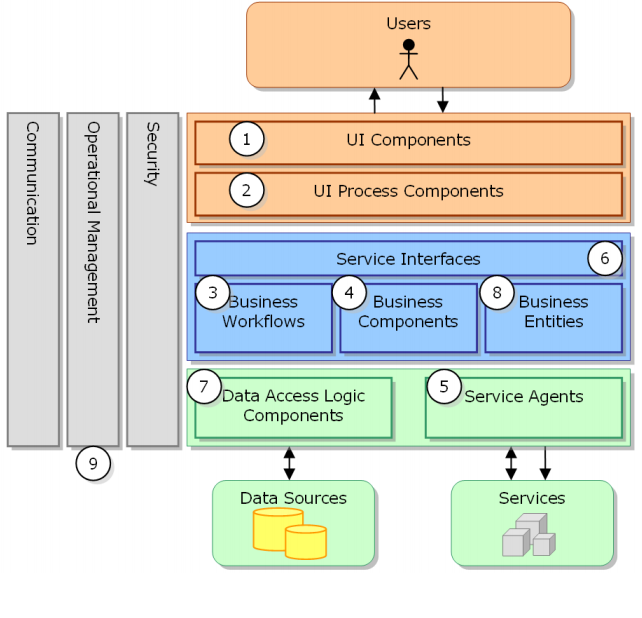

# AMIGOS Backend Server
This repository contains the backend part of the AMIGOS application.
* Java 11
* MySQL 8 + MSSQL

# Database
## Liquibase

This project uses liquibase to set up and version the database.
### Contexts
### Liquibase handling
The project contains the Liquibase Maven plugin which wraps up some of the functionality of Liquibase.db-changelog-master.xml

Liquibase Maven can be configured in multiple ways. The project uses configuration via the file `src/main/resources/db/db-changelog-master.xml`

### Libraries
+ Spring security, jwt, lombok, liquibase, mockito, apache poi,...

**Architecture 3 layer**

- _Flow git:_
    + backend is root branch for backend application(Backend)
    + admin-ui is root branch for admin ui(Frontend)
    + ui-client is root branch for client ui(Frontend)

**Docker Build**
- This app using docker compose(refer to docker-compose.yml)
+ mvn install -Dmaven.test.skip=true -> to build amigos:latest
+ image: docker image build -t amigos .  
+ docker compose up --build -> the port will be 8081

**Document Api**
- Refer to: http://localhost:8081/swagger-ui.html
